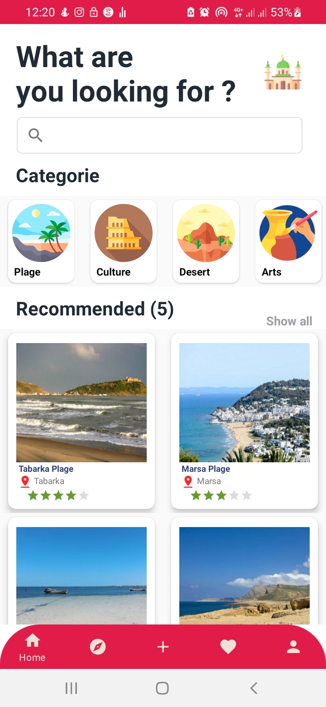
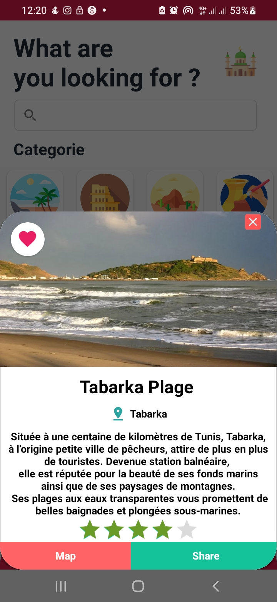
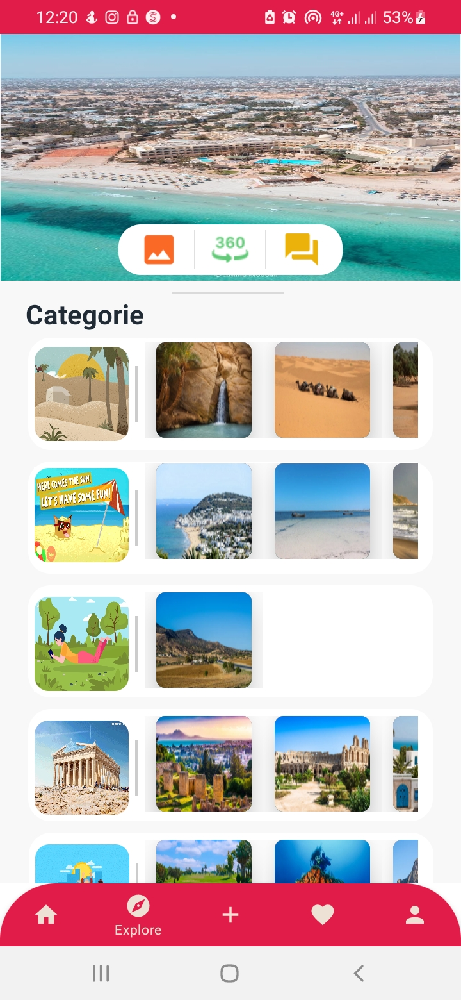
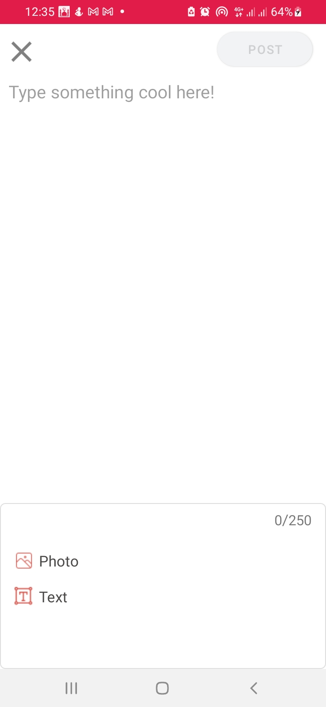
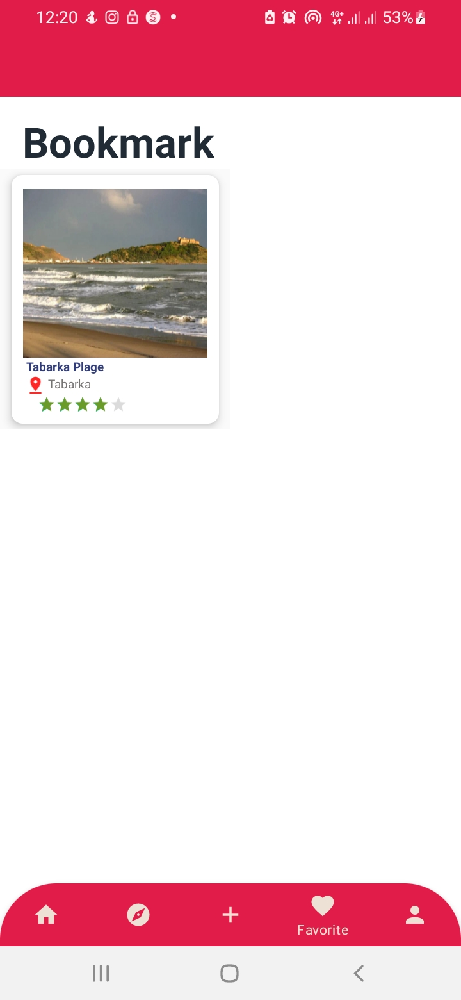
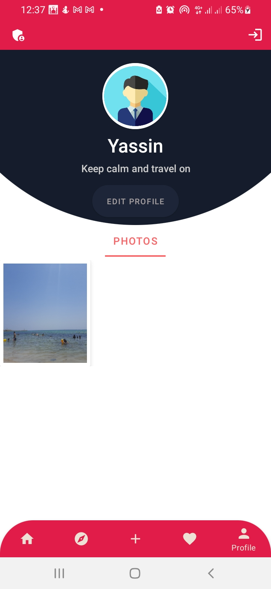
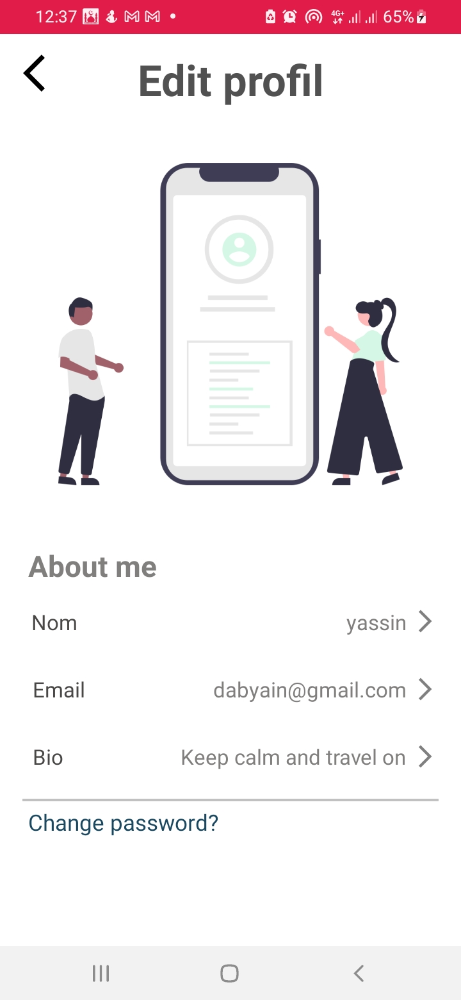

<h1 align="center"> Discovery 📱 </h1>
Discovery app📱helps you find where to spend your vacation. Whatever your age or your tastes🌎, your stay will be pleasant and cultural at the same time by choosing your Discover Tunisia tourist guide🗺️.
 
<h1 align="center"> Screenshot </h1>
 

*Note: The following screenshots provide only a subset for a quick overview. Not all screenshots are included here. More images are available, showcasing various features and aspects of the Discovery app. You can explore the complete set of screenshots by [contacting me](mailto:yassin.daboussi@esprit.tn) or by checking the project directly.*

    

     
      
      
      
       
     
      
      
      
    

(<a href="#top">back to top</a>)

<h2>🌟Star this repository🌟</h2>

Please ⭐️ this repo and share it with others

 

    

   
    
  
    

This project is licensed under the **View-Only License**. See the [LICENSE](LICENSE) file for details.

(<a href="#top">back to top</a>)

