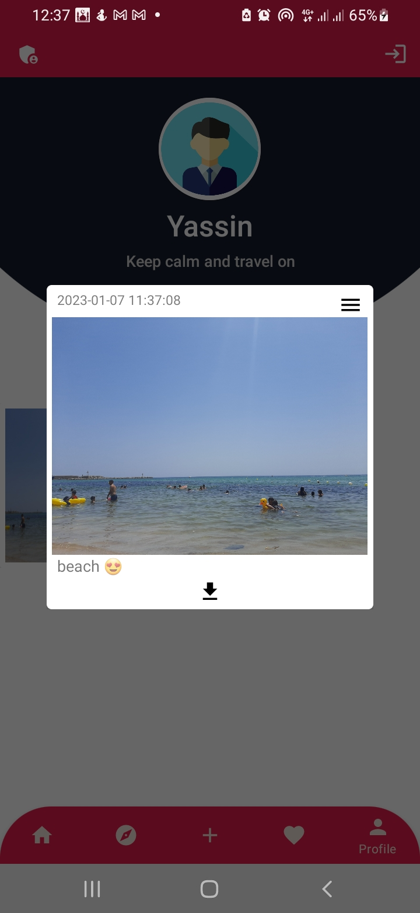

<h1 align="center"> Discovery 📱 </h1>
Discovery app📱helps you find where to spend your vacation. Whatever your age or your tastes🌎, your stay will be pleasant and cultural at the same time by choosing your Discover Tunisia tourist guide🗺️.
 
<h1 align="center"> Screenshot </h1>
 

    

     
      
      
      
       
     
      
      
      
    

(<a href="#top">back to top</a>)

### Built With

This section should list any major frameworks/libraries used to bootstrap your project.
* [Kotlin](https://kotlinlang.org)
* [NodeJs](https://nodejs.org/en/)
* [ExpressJs](https://expressjs.com/fr/)
* [MongoDB](https://www.mongodb.com)

(<a href="#top">back to top</a>)

<h2>🌟Star this repository🌟</h2>

Please ⭐️ this repo and share it with others

 

   
    
  

(<a href="#top">back to top</a>)

